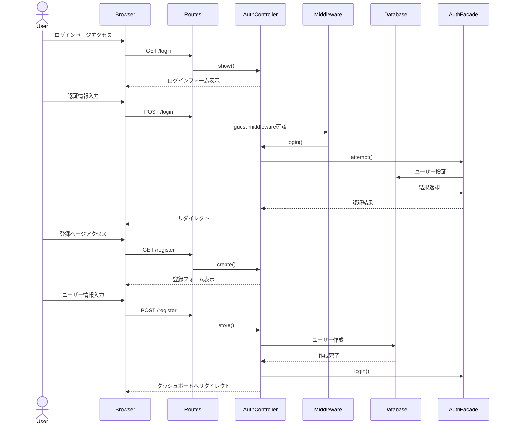

# Laravel Breeze 認証シーケンス

```mermaid
sequenceDiagram
    actor User
    participant Browser
    participant Routes
    participant AuthController
    participant Middleware
    participant Database
    participant AuthFacade

    %% ログインフロー
    User->>Browser: ログインページアクセス
    Browser->>Routes: GET /login
    Routes->>AuthController: show()
    AuthController-->>Browser: ログインフォーム表示

    User->>Browser: 認証情報入力
    Browser->>Routes: POST /login
    Routes->>Middleware: guest middleware確認
    Middleware->>AuthController: login()
    AuthController->>AuthFacade: attempt()
    AuthFacade->>Database: ユーザー検証
    Database-->>AuthFacade: 結果返却
    AuthFacade-->>AuthController: 認証結果
    AuthController-->>Browser: リダイレクト

    %% 新規登録フロー
    User->>Browser: 登録ページアクセス
    Browser->>Routes: GET /register
    Routes->>AuthController: create()
    AuthController-->>Browser: 登録フォーム表示

    User->>Browser: ユーザー情報入力
    Browser->>Routes: POST /register
    Routes->>AuthController: store()
    AuthController->>Database: ユーザー作成
    Database-->>AuthController: 作成完了
    AuthController->>AuthFacade: login()
    AuthController-->>Browser: ダッシュボードへリダイレクト
```
