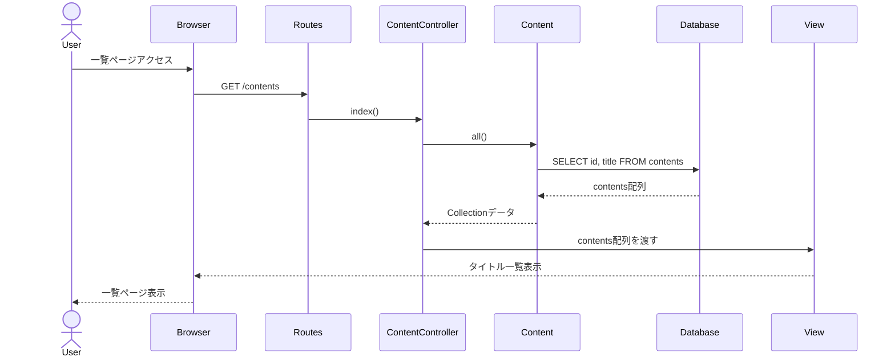

# コンテンツ一覧表示シーケンス

```mermaid
sequenceDiagram
    actor User
    participant Browser
    participant Routes
    participant ContentController
    participant Content
    participant Database
    participant View

    User->>Browser: 一覧ページアクセス
    Browser->>Routes: GET /contents
    Routes->>ContentController: index()

    ContentController->>Content: all()
    Content->>Database: SELECT id, title FROM contents
    Database-->>Content: contents配列
    Content-->>ContentController: Collectionデータ

    ContentController->>View: contents配列を渡す
    View-->>Browser: タイトル一覧表示
    Browser-->>User: 一覧ページ表示
```
