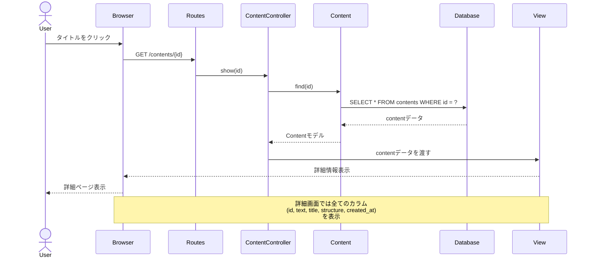

# コンテンツ詳細表示シーケンス

```mermaid
sequenceDiagram
    actor User
    participant Browser
    participant Routes
    participant ContentController
    participant Content
    participant Database
    participant View

    %% 一覧画面での操作
    User->>Browser: タイトルをクリック
    Browser->>Routes: GET /contents/{id}
    Routes->>ContentController: show(id)

    %% データ取得処理
    ContentController->>Content: find(id)
    Content->>Database: SELECT * FROM contents WHERE id = ?
    Database-->>Content: contentデータ
    Content-->>ContentController: Contentモデル

    %% 詳細画面表示
    ContentController->>View: contentデータを渡す
    View-->>Browser: 詳細情報表示
    Browser-->>User: 詳細ページ表示

    Note over Browser,View: 詳細画面では全てのカラム<br/>(id, text, title, structure, created_at)<br/>を表示
```
