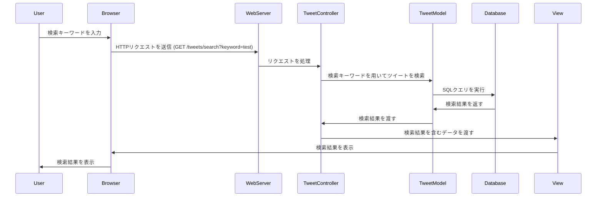

```mermaid
sequenceDiagram
    participant User
    participant Browser
    participant WebServer
    participant TweetController
    participant TweetModel
    participant Database
    participant View

    User->>Browser: 検索キーワードを入力
    Browser->>WebServer: HTTPリクエストを送信 (GET /tweets/search?keyword=test)
    WebServer->>TweetController: リクエストを処理
    TweetController->>TweetModel: 検索キーワードを用いてツイートを検索
    TweetModel->>Database: SQLクエリを実行
    Database->>TweetModel: 検索結果を返す
    TweetModel->>TweetController: 検索結果を渡す
    TweetController->>View: 検索結果を含むデータを渡す
    View->>Browser: 検索結果を表示
    Browser->>User: 検索結果を表示
```
