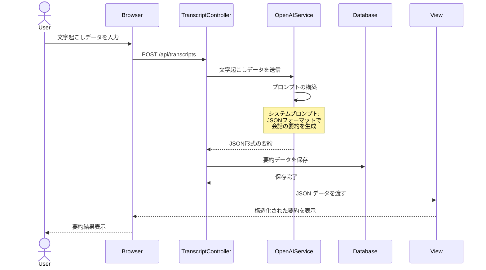

# 構造化のシーケンス

```mermaid
sequenceDiagram
    actor User
    participant Browser
    participant TranscriptController
    participant OpenAIService
    participant Database
    participant View

    %% データ送信フロー
    User->>Browser: 文字起こしデータを入力
    Browser->>TranscriptController: POST /api/transcripts

    %% AI処理
    TranscriptController->>OpenAIService: 文字起こしデータを送信
    OpenAIService->>OpenAIService: プロンプトの構築
    Note over OpenAIService: システムプロンプト:<br/>JSONフォーマットで<br/>会話の要約を生成

    OpenAIService-->>TranscriptController: JSON形式の要約

    %% データ保存と表示
    TranscriptController->>Database: 要約データを保存
    Database-->>TranscriptController: 保存完了

    TranscriptController->>View: JSON データを渡す
    View-->>Browser: 構造化された要約を表示
    Browser-->>User: 要約結果表示
```
